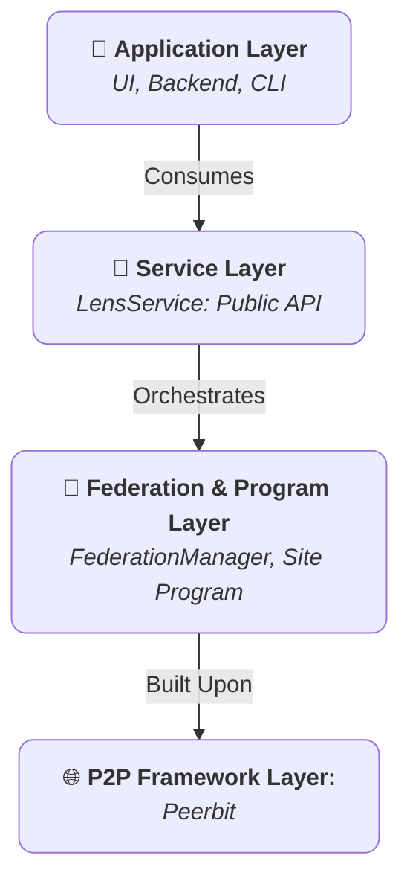

+++
date = '2025-07-22T05:44:53+02:00'
draft = false
title = 'Core Concepts'
weight = 2
+++

लेंस एसडीके को मजबूत, इंटरऑपरेबल घटकों के सेट के आसपास डिजाइन किया गया है। एसडीके की पूर्ण शक्ति और सुरक्षा का लाभ उठाने के लिए इन कोर अवधारणाओं की पूरी समझ आवश्यक है। यह दस्तावेज लेंस वास्तुकला के मूलभूत स्तंभों का एक विस्तृत विवरण प्रदान करता है: `एलेंस सर्विस `, `साइट` कार्यक्रम, फेडरेशन मॉडल और एक्सेस कंट्रोल सिस्टम.

## 1. लेयर्ड आर्किटेक्चर

एसडीके मॉड्यूलरता, सुरक्षा और रखरखाव को बढ़ावा देने के लिए एक सख्त, लेयर्ड आर्किटेक्चर को नियोजित करता है। प्रत्येक परत की एक विशिष्ट जिम्मेदारी होती है, और अच्छी तरह से परिभाषित इंटरफेस के माध्यम से संचार ऊर्ध्वाधर रूप से बहता है।

* **सेवा परत (``एलेंस सर्विस`):** यह sdk के लिए कैननिकल पब्लिक इंटरफेस है। किसी भी उपभोक्ता अनुप्रयोग के लिए यह एकमात्र प्रवेश बिंदु है। इसका उद्देश्य एक स्थिर, उच्च स्तर और अतुल्यकालिक एपीआई प्रदान करना है जो पूरी तरह से अंतर्निहित p2p नेटवर्क और प्रोग्राम तर्क की जटिलताओं को अमूर्त करता है। सेवा स्तर पी2पी क्लाइंट के जीवन चक्र और सक्रिय 'साइट' कार्यक्रम के प्रबंधन के लिए जिम्मेदार है।.

* **प्रोग्राम परत (`साइट` प्रोग्राम):** यह है "ऑन-चेन" या अनुप्रयोग के विकेन्द्रीकृत बैकएण्ड.`साइट` कार्यक्रम एक राज्य है, प्रतिकृति "स्मार्ट कॉन्ट्रैक्ट" जो अनुप्रयोग के डाटा स्कीमा को परिभाषित करता है, डेटाबेस, और डेटा अभिगम को नियंत्रित करने वाले अपरिवर्तनीय नियम. यह सभी सामग्री और अनुमति के लिए एक दिए गए के भीतर सत्य का अंतिम स्रोत है `साइट`.

* **संघीय परत (`संघीय प्रबंधक`):** यह एक विशेषीकृत है, आंतरिक घटक द्वारा प्रबंधित`एलेंस सर्विस`.यह सभी इंटर-प्रोग्राम संचार को व्यवस्थित करता है.जबकि प्रोग्राम * क्या डेटा मौजूद है,`संघीय प्रबंधक` को परिभाषित करता है कि डेटा की खोज की गई है, तुल्यकालिक, और विभिन्न उदाहरणों के बीच साझा। `साइट`.

* **पी2पी फ्रेमवर्क लेयर (पीयरबिट):**मूलभूत परत जो पीयर-टू-पीयर नेटवर्किंग, डेटाबेस निर्माण के लिए आवश्यक प्राइमिटिव प्रदान करता है, डेटा प्रतिकृति, और क्रिप्टोग्राफिक पहचान. लेंस एसडीके इस मजबूत ढांचे पर सीधे बनाया गया है.

## 2.`साइट` प्रोग्राम: एक सॉवरेन डिजिटल एंटिटी

लेंस इकोसिस्टम में केंद्रीय निर्माण है `साइट`. कन्सेप्चूअल्ली,एक `साइट` एक संप्रभु, पता योग्य और स्व-निहित डिजिटल स्थान है। यह एक विकेंद्रीकृत एप्लिकेशन इंस्टेंस के रूप में कार्य करता है, जिसमें अपनी स्वयं की डेटाबेस और पहुँच नियंत्रण प्रणाली होती है।

### एक की मुख्य विशेषताएं `साइट`

* **अद्वितीय, सत्यापन योग्य पता:**हर `साइट` को उसके मालिक की सार्वजनिक कुंजी और उसकी प्रारंभिक पैरामीटर्स से निकाले गए स्थायी, क्रिप्टोग्राफिक पते द्वारा पहचाना जाता है। इस पते का उपयोग नेटवर्क पर `साइट` को ढूँढने, खोलने और उसके साथ इंटरैक्ट करने के लिए किया जाता है।
* **संरचित डेटा स्टोर:**`साइट` विभिन्न, विशेष उद्देश्य के लिए बनाए गए डेटा स्टोर्स का संग्रह है, जैसे कि `विज्ञप्ति`, `सामग्री श्रेणियाँ`, `सदस्यता` और अन्य। यह संरचित दृष्टिकोण डेटा की अखंडता और संगठनात्मक स्पष्टता सुनिश्चित करता है।
* **स्पष्ट अनुमतियाँ:** `साइट` तक पहुँच डिफ़ॉल्ट रूप से सार्वजनिक नहीं होती है। सभी लेखन अनुमतियाँ स्पष्ट रूप से एक **प्रशासक** द्वारा एक मजबूत भूमिका-आधारित पहुँच नियंत्रण (आरबीएसी) प्रणाली के माध्यम से प्रदान की जाती हैं।
## 3. फेडरेशन मॉडल: सिद्धांत आधारित डेटा एक्सचेंज

फेडरेशन वह प्रक्रिया है जिसके द्वारा स्वतंत्र `साइट` उदाहरण डेटा साझा करते हैं। Lens SDK एक सिद्धांत-आधारित, सब्सक्रिप्शन मॉडल को लागू करता है ताकि सुनिश्चित किया जा सके कि सभी डेटा विनिमय जानबूझकर और सुरक्षित रूप से हो।

### संघ जीवनचक्र

1. **स्पष्ट सदस्यता:**यह प्रक्रिया उस उपयोगकर्ता द्वारा शुरू की जाती है जिसके पास `सदस्यता:प्रबंधित करना` अनुमति है (आमतौर पर एक `मॉडरेटर` या `एडमिन`)। फ़ेडरेट करने के लिए, वे एक `सब्सक्रिप्शन` रिकॉर्ड बनाते हैं जिसमें लक्ष्य `साइट` का पता शामिल होता है। यह क्रिया विश्वास की जानबूझकर घोषणा है।

2. **राज्य समकालिकीकरण:** `सदस्यता` के निर्माण के समय, `फेडरेशन मैनेजर` दो प्रकार के समकालिकीकरण करता है:
    * **ऐतिहासिक समन्वय:** एक एकबारगी प्रक्रिया जो रिमोट `साइट` से जुड़ती है और इसके मौजूदा सार्वजनिक सामग्री (जैसे, `रिलीज़`) की नकल करती है।
    * **लाइव सिंक:** प्रबंधक रिमोट `साइट` के समर्पित पब/सबसक्राइब टॉपिक को सब्सक्राइब करता है, जिससे तात्कालिक अपडेट के लिए एक स्थायी, वास्तविक समय संचार चैनल बनता है।

3. **डेटा प्रावेनेंस:** फ़ेडरेशन के माध्यम से प्राप्त सभी डेटा अपरिवर्तनीय हैं और इसके मूल लेखक के क्रिप्टोग्राफ़िक हस्ताक्षर और इसके उत्पत्ति वाले `साइट` का पता रखते हैं। यह सुनिश्चित करता है कि सभी सामग्री का स्रोत सत्यापित किया जा सकता है।

4.**लाइफसाइकिल समाप्ति:** यदि कोई `सदस्यता` हटाया जाता है, तो `फेडरेशन मैनेजर` एक क्लीनअप ऑपरेशन करता है, जिससे सभी डेटा जो अनसब्सक्राइब किए गए `साइट` से संबंधित हैं, उसके स्थानीय डेटाबेस से हटा दिए जाते हैं।

## 4.एक्सेस कंट्रोल सिस्टम (आरबीएसी)

सुरक्षा `साइट` प्रोग्राम का अभिन्न हिस्सा है। सिस्टम एक मजबूत और सुरक्षित **रोल-आधारित एक्सेस कंट्रोल (आरबीएसी)** मॉडल पर आधारित है, जिसे एक समर्पित आंतरिक `भूमिका-आधारित एक्सेस नियंत्रक` द्वारा प्रबंधित किया जाता है। यह कंट्रोलर `साइट` के भीतर सभी कार्यों के लिए अंतिम प्राधिकरण है।

### पहचान और हस्ताक्षर

हर वह क्रिया जो किसी `साइट` को संशोधित करती है (जैसे रिलीज़ जोड़ना या रोल असाइन करना) को क्रिप्टोग्राफिक रूप से साइन किया जाना चाहिए। लेंस एसडीके इस पहचान के लिए दो मॉडलों का समर्थन करता है:

1. **डिफ़ॉल्ट नोड पहचान:** यदि आप `एलेंस सर्विस` को किसी कस्टम पहचान निर्दिष्ट किए बिना प्रारंभ करते हैं, तो यह पीयरबिट नोड से जुड़ी एक स्वचालित रूप से उत्पन्न पहचान का उपयोग करेगा। यह सर्वर-साइड स्क्रिप्ट या हेडलेस नोड्स के लिए उपयुक्त है, जहाँ एक सिंगल, स्थिर पहचान आवश्यक होती है।

2.**कस्टम वॉलेट पहचान:** उपयोगकर्ता से संबंधित अनुप्रयोगों के लिए, अनुशंसित तरीका यह है कि उपयोगकर्ता के अपने वॉलेट (जैसे, मेटामास्क) से प्राप्त कस्टम पहचान प्रदान की जाए। जब आप इस कस्टम पहचान के साथ `एलेंस सर्विस` को प्रारंभ करते हैं, तो **सभी बाद के कार्य उपयोगकर्ता के वॉलेट द्वारा हस्ताक्षरित होते हैं**। यह सुनिश्चित करता है कि सामग्री का वास्तविक मालिक और लेखक उपयोगकर्ता ही है, न कि एप्लिकेशन नोड। यह लेंस एसडीके में डेटा संप्रभुता का आधार है।

### आरबीएसी घटक

* **व्यवस्थापकों (`विश्वसनीय नेटवर्क`):** उच्च स्तर पर प्रशासकों का एक `विश्वसनीय नेटवर्क` होता है। किसी भी उपयोगकर्ता जिसकी सार्वजनिक कुंजी इस नेटवर्क में है, उसे **व्यवस्थापक** माना जाता है। व्यवस्थापक के पास सार्वभौमिक अनुमतियाँ होती हैं और केवल वही उपयोगकर्ता हैं जो स्वयं RBAC सिस्टम का प्रबंधन कर सकते हैं (जैसे, नए रोल बनाना, उपयोगकर्ताओं को रोल असाइन करना, या अन्य व्यवस्थापक जोड़ना)। एक `साइट` का प्रारंभिक निर्माता इसका पहला `व्यवस्थापक` होता है।

* **भूमिकाएँ:** एक `भूमिका` विशिष्ट अनुमतियों का नामित संग्रह होती है। एक `साइट` को डिफ़ॉल्ट भूमिकाओं के सेट के साथ आरंभ किया जाता है, और एडमिन आवश्यकतानुसार नई कस्टम भूमिकाएँ बना सकते हैं।

* **अनुमतियाँ:** एक 'अनुमति' एक विस्तृत स्ट्रिंग है जो एक विशिष्ट क्रिया का प्रतिनिधित्व करती है, आमतौर पर प्रारूप में '"संसाधन: कार्रवाई"' (उदाहरण के लिए, '"रिलीज़: हटाएं")।

* **असाइनमेंट:** एक `असाइनमेंट` एक उपयोगकर्ता की सार्वजनिक कुंजी और एक `भूमिका` के बीच सत्यापनीय लिंक है। उपयोगकर्ता उन भूमिकाओं के आधार पर अनुमति प्राप्त करता है जो उन्हें असाइन की गई हैं।

### डिफ़ॉल्ट भूमिकाएँ और अनुमतियाँ तालिका

एक `साइट` में स्पष्ट रूप से निर्धारित डिफ़ॉल्ट भूमिकाएँ होती हैं, जो तुरंत उपयोग के लिए एक तार्किक अनुमति संरचना प्रदान करती हैं। एक **एडमिन** नीचे सूचीबद्ध सभी क्रियाएँ कर सकता है।

| क्रिया / अनुमति (`संसाधन:कार्रवाई`) | मॉडरेटर | सदस्य | अतिथि | विवरण                                                              |
|-----------------------------------------|:---------:|:------:|:-----:|--------------------------------------------------------------------------|
| **`मुक्त करना:create`**                    | ✅        | ✅     | ❌    | नई `रिलीज़` प्रकाशित कर सकते हैं दस्तावेज़.                                     |
| **`मुक्त करना:संपादित करें:स्वयं`**                  | ✅        | ✅     | ❌    | वे जिन `रिलीज़` दस्तावेज़ों को उन्होंने स्वयं पोस्ट किया है, उन्हें संपादित कर सकते हैं।                     |
| **`मुक्त करना:संपादित करें: कोई भी`**                  | ✅        | ❌     | ❌    | साइट पर किसी भी उपयोगकर्ता द्वारा पोस्ट किए गए `Release` दस्तावेज़ को संपादित कर सकते हैं.           |
| **`मुक्त करना:मिटाना`**                    | ✅        | ❌     | ❌    | साइट से किसी भी `रिलीज़` को हटाया जा सकता है.                                  |
| **`प्रदर्शित:प्रबंधित करना`**                   | ✅        | ❌     | ❌    | सृजन कर सकते हैं, संपादित कर सकते हैं, या हटा सकते हैं
`फीचर्डरिलीज़` प्रविष्टियाँ.                   |
| **`वर्ग:प्रबंधित करना`**                   | ✅        | ❌     | ❌    | सृजन कर सकते हैं, संपादित कर सकते हैं, या हटा सकते हैं
`सामग्री श्रेणी` दस्तावेज़.                 |
| **`ब्लॉकलिस्ट:प्रबंधित करना`**                  | ✅        | ❌     | ❌    | बना या हटाया जा सकता है
`अवरुद्ध सामग्री` प्रविष्टियाँ.                           |
| **`सदस्यता:प्रबंधित करना`**               | ✅        | ❌     | ❌    | अन्य साइटों की सदस्यता ले सकते हैं या सदस्यता समाप्त कर सकते हैं।.                        |

* **अतिथि (अप्रत्यक्ष भूमिका):** यह किसी भी उपयोगकर्ता के लिए डिफ़ॉल्ट स्थिति है जो एडमिन नहीं है और जिसे कोई भूमिका नहीं सौंपी गई है। `अतिथि` केवल पढ़ सकते हैं और कोई लिखने का कार्य नहीं कर सकते।

### संघ और अनुमतियाँ

RBAC मॉडल संघीय सामग्री तक बुद्धिमानी से विस्तारित होता है। जबकि भरोसा मुख्य रूप से सदस्यता पर आधारित होता है, Lens SDK एक शक्तिशाली अधिलेख प्रदान करता है: **एक स्थानीय `प्रशासक` या `मध्यस्थ` हमेशा संघीय सामग्री पर कार्रवाई कर सकता है** (उदा., किसी अनसदस्यित साइट से पुरानी पोस्ट हटाना)। यह सुनिश्चित करता है कि स्थानीय साइट मालिक अपने डेटाबेस में संग्रहित सामग्री पर अंतिम नियंत्रण बनाए रखें।